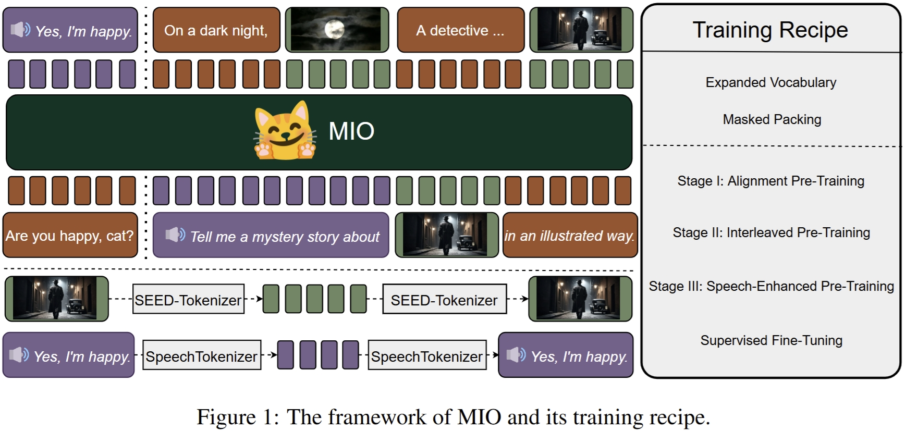
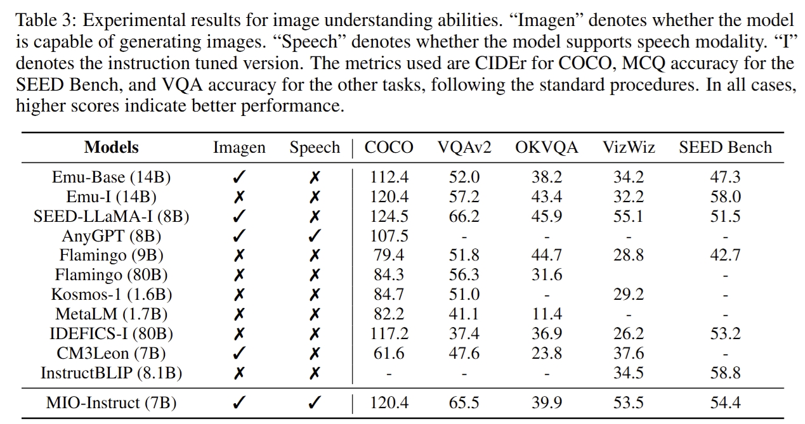
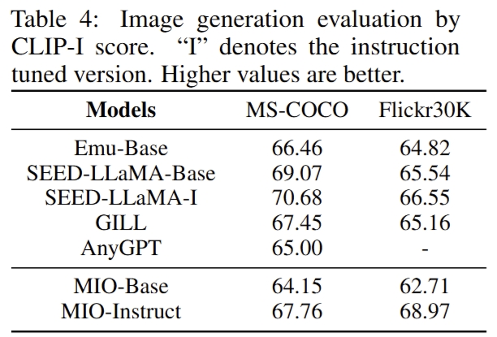
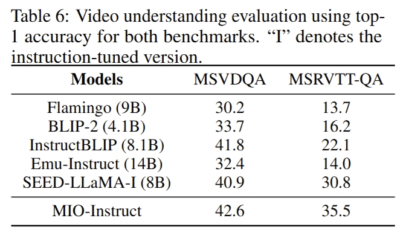
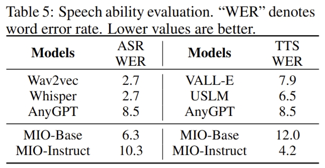
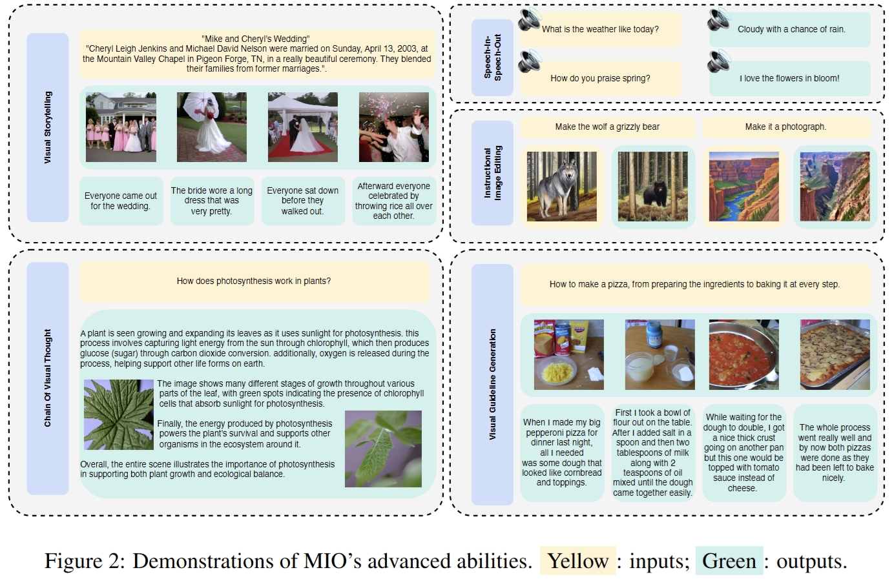
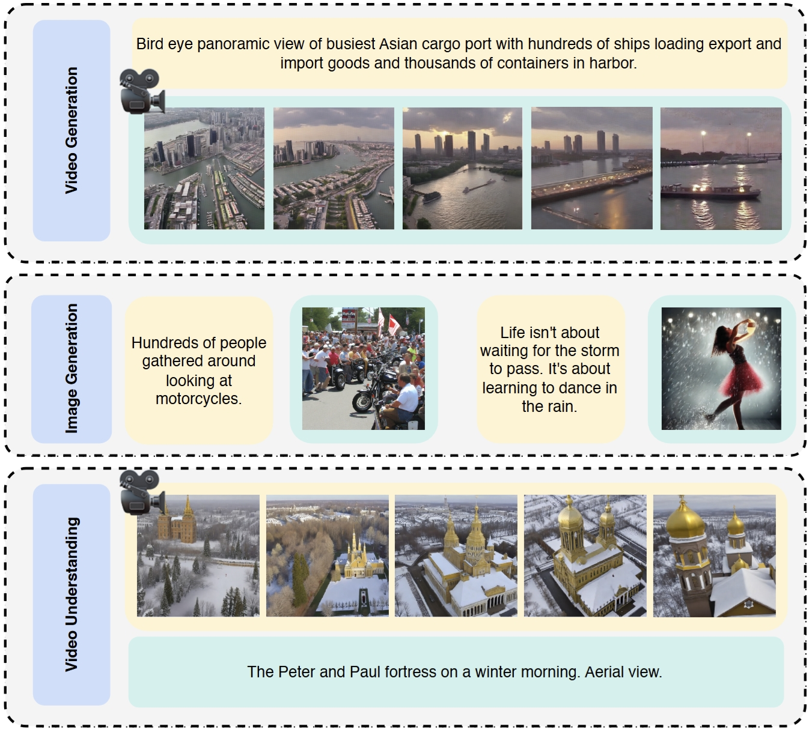
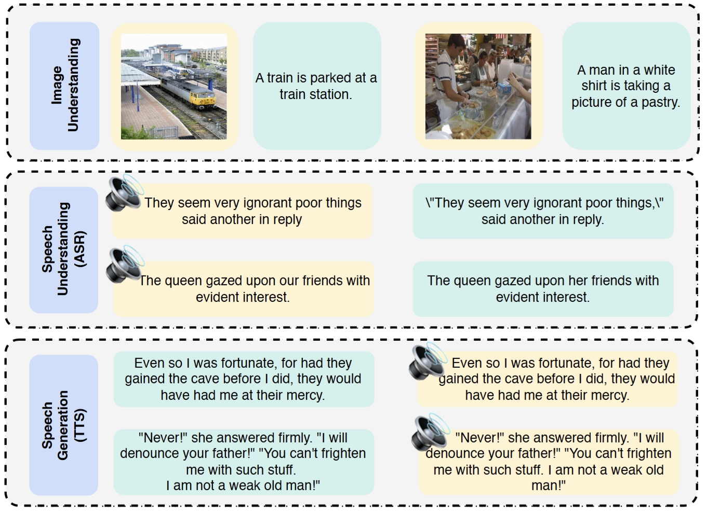
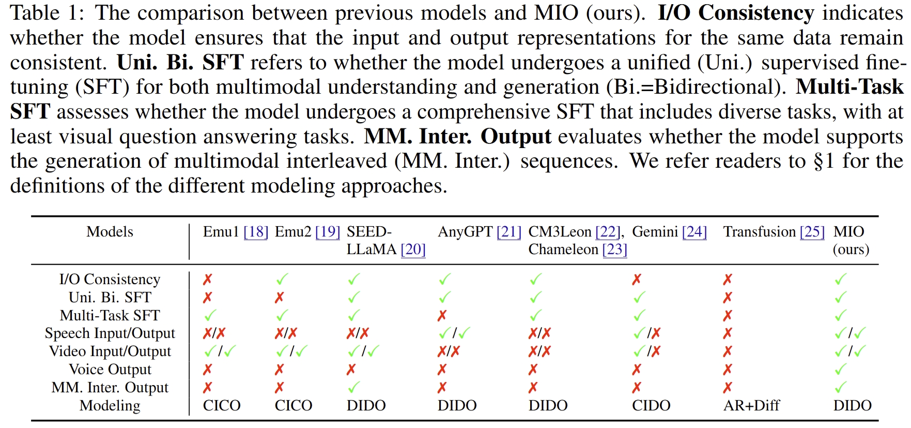

<div align="center" style="display: flex; justify-content: center; align-items: center;">
    
    <h1 style="margin: 0;">MIO</h1>
</div>


<p align="center">  
MIO: A Foundation Model on Multimodal Tokens
</p>

<p align="center">
<a href="https://arxiv.org/abs/2409.17692">
  
</a>

<a href="https://huggingface.co/m-a-p/MIO-7B-Base">
  
</a>
<a href="https://huggingface.co/m-a-p/MIO-7B-Instruct">
  
</a>
</p>

## Abstract

In this paper, we introduce MIO, a novel foundation model built on multimodal tokens, capable of understanding and
generating speech, text, images, and videos in an end-to-end, autoregressive manner. While the emergence of large
language models (LLMs) and multimodal large language models (MM-LLMs) propels advancements in artificial general
intelligence through their versatile capabilities, they still lack true any-to-any understanding and generation.
Recently, the release of GPT-4o has showcased the remarkable potential of any-to-any LLMs for complex real-world tasks,
enabling omnidirectional input and output across images, speech, and text. However, it is closed-source and does not
support the generation of multimodal interleaved sequences. To address this gap, we present MIO, which is trained on a
mixture of discrete tokens across four modalities using causal multimodal modeling. MIO undergoes a four-stage training
process: (1) alignment pre-training, (2) interleaved pre-training, (3) speech-enhanced pre-training, and (4)
comprehensive supervised fine-tuning on diverse textual, visual, and speech tasks. Our experimental results indicate
that MIO exhibits competitive, and in some cases superior, performance compared to previous dual-modal baselines,
any-to-any model baselines, and even modality-specific baselines. Moreover, MIO demonstrates advanced capabilities
inherent to its any-to-any feature, such as interleaved video-text generation, chain-of-visual-thought reasoning, visual
guideline generation, instructional image editing, etc.

## Method



## Evaluation






## Demonstrations





## Feature Checklist



| Feature                           | Input Modality   | Output Modality  | Supported Model Version | Feature Strength |
|-----------------------------------|------------------|------------------|-------------------------|------------------|
| Text Generation                   | Text             | Text             | Base, Instruct          | 🔧 Medium        |
| Image Captioning                  | Image            | Text             | Base, Instruct          | ⭐ High           |
| Image Understanding               | Image            | Text             | Instruct                | ⭐ High           |
| Image Generation                  | Text             | Image            | Base, Instruct          | 🔧 Medium        |
| Image Editing                     | Text,Image       | Image            | Instruct                | 🔧 Medium        |
| ASR (Speech to Text)              | Speech           | Text             | Base, Instruct          | 🔧 Medium        |
| TTS (Text to Speech)              | Text             | Speech           | Base, Instruct          | 🔧 Medium        |
| Speech Understanding              | Speech           | Text             | Instruct                | ⚠️ Low           |
| Speech Generation                 | Text             | Speech           | Instruct                | ⚠️ Low           |
| Speech to Speech Generation       | Speech           | Speech           | Instruct                | ⚠️ Low           |
| Video Captioning                  | Video            | Text             | Base, Instruct          | ⭐ High           |
| Video Understanding               | Video            | Text             | Instruct                | ⭐ High           |
| Video Generation                  | Text             | Video            | Base, Instruct          | ⚠️ Low           |
| Multimodal Interleaved Generation | Text,Image,Video | Text,Image,Video | Instruct                | 🔧 Medium        |
| Chain of Visual Thought           | Text             | Text,Image       | Instruct                | ⚠️ Low           |
| Multimodal In-Context Learning    | Text,Image       | Text             | Instruct                | ⭐ High           |
| Multimodal Chain-of-Thought       | Text,Image       | Text             | Instruct                | 🔧 Medium        |        
| Chart Understanding               | Text,Image       | Text             | Instruct                | ⚠️ Low           |
| Visual Storytelling               | Text             | Text,Image       | Instruct                | 🔧 Medium        |

> Note that "video" only refers to the video keyframes, not involving the audio or all frames in the video.

> The Feature Strength indicates the relative performance and reliability of each feature.
> - ⚠️ **Low**: Requires very strict prompt engineering techniques and can only occasionally activate the capability.
> - 🔧 **Medium**: Does not require extensive prompt engineering but has limited performance.
> - ⭐ **High**: The performance is promising.

## Inference

### Environment Setup

```bash
git clone https://github.com/MIO-Team/MIO.git
cd MIO
conda create -n mio python=3.10
conda activate mio
pip install -r requirements.txt
```

### File Structure

- `tokenization_mio.py`: (1) image/speech preprocessing, quantization, and decoding; (2) multimodal tokenization and detokenization; (3) applying the chat template.
- `utils.py`: extracting the frames from the video (both keyframe extraction and uniform frame extraction).
- `infer.py`: inference script for MIO, with the examples for each feature.
- `/image_tokenizer`
- `/speech_tokenizer`

### Run Inference

Please read the TODOs and examples in the `infer.py` script to understand how to run the inference for each feature.

```bash
python infer.py
```

1. Set the most appropriate generation config (it's recommended to conduct a hyperparameter search).
2. Pay attention to the input data structures, formats, instructions, and the prompt templates.
3. Tokenize the input data and don't forget to apply the chat template in the suitable mode (`voice` v.s. `std`).
4. Generate the responses.
5. Detokenize the responses and save the results (`detokenized_{modality}_{sample_id}_{image/speech_index}.{suffix}`).

### Citation

```bibtex
@article{wang2024mio,
  title   = {MIO: A Foundation Model on Multimodal Tokens},
  author  = {Zekun Wang and King Zhu and Chunpu Xu and Wangchunshu Zhou and Jiaheng Liu and Yibo Zhang and Jiashuo Wang and Ning Shi and Siyu Li and Yizhi Li and Haoran Que and Zhaoxiang Zhang and Yuanxing Zhang and Ge Zhang and Ke Xu and Jie Fu and Wenhao Huang},
  year    = {2024},
  journal = {arXiv preprint arXiv: 2409.17692}
}
```
